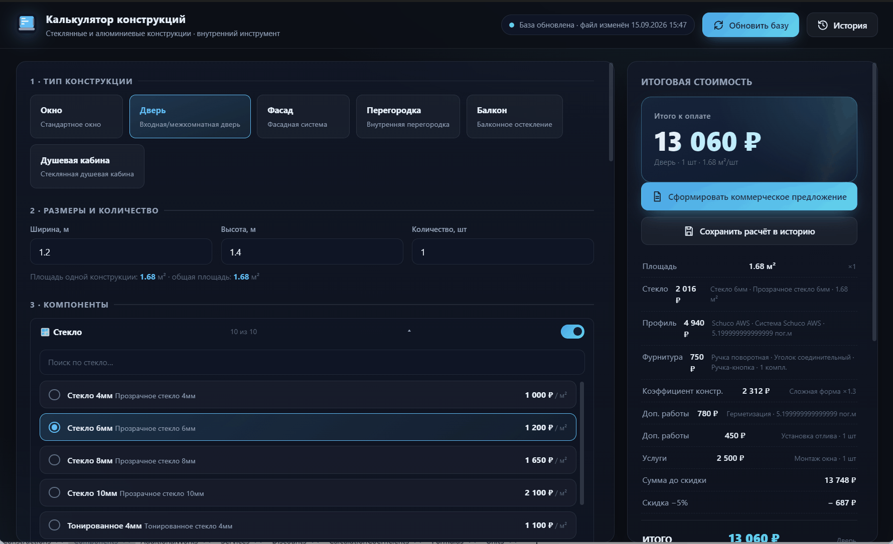
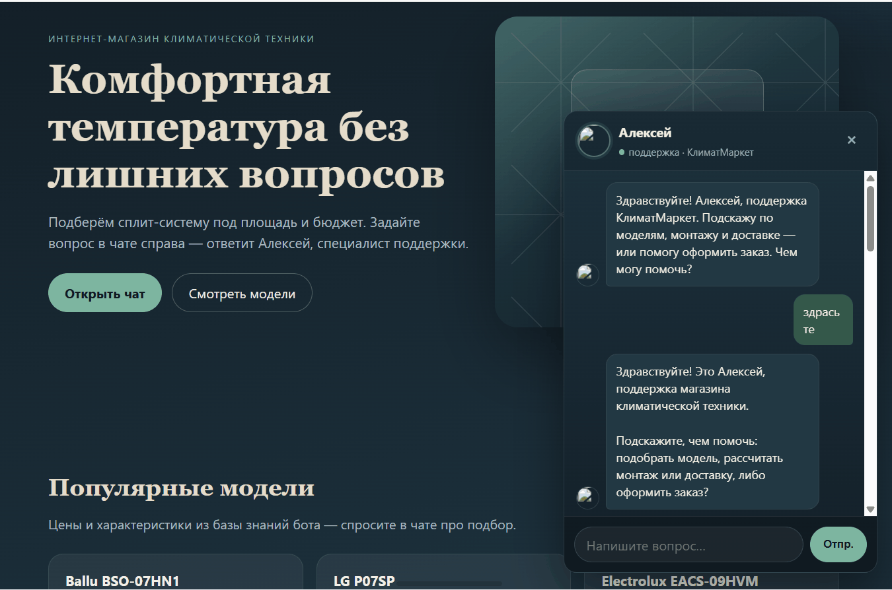
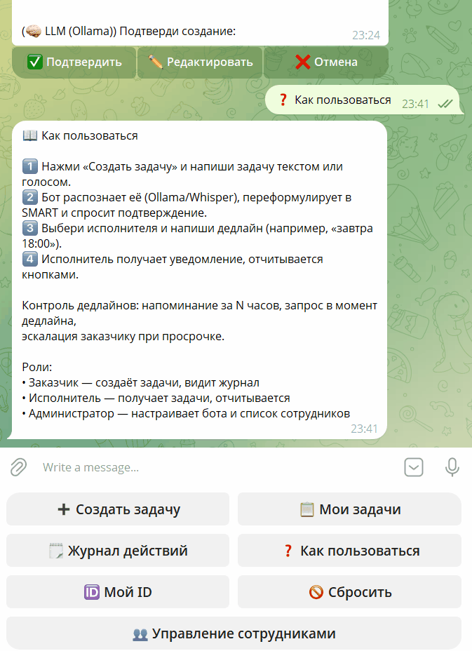
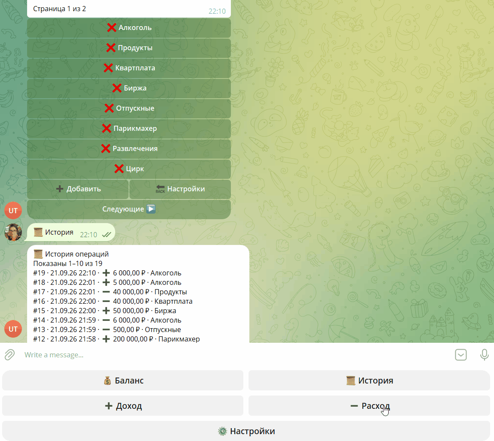
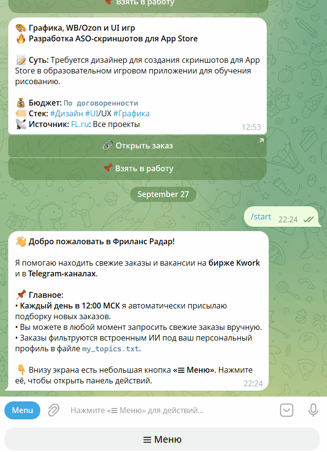
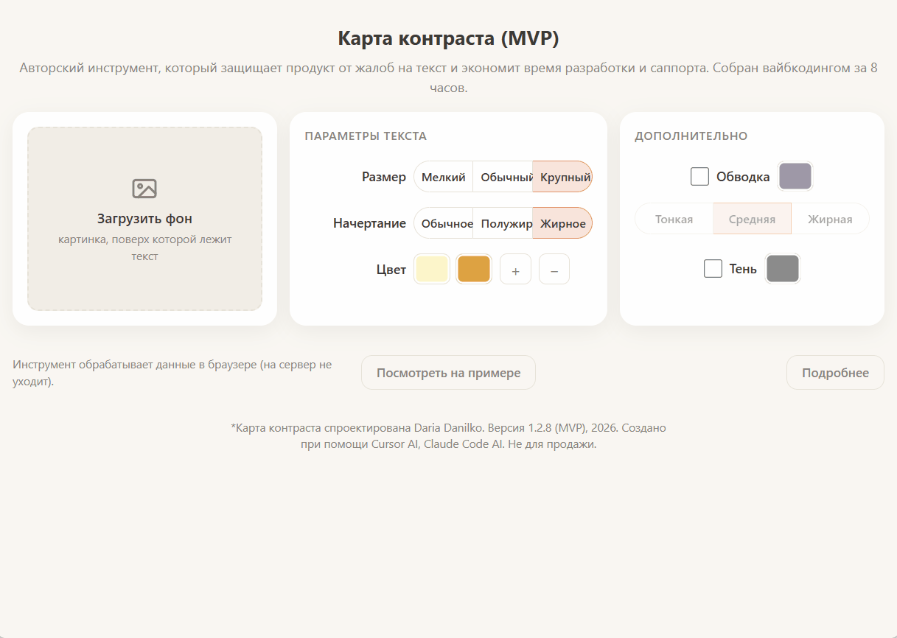

# Дарья Данилко

               

---

Делаю инструменты под ключ: бизнес-калькуляторы, Telegram/VK/сайт-боты для любых задач, системы контроля поручений и финансов. Передаю готовый инструмент с user-friendly интерфейсом для удобной работы команды.

## 🎯 Чем могу помочь

Разрабатываю инструменты под ваши задачи. Ко мне обращаются, когда нужно:

- 💰 Навести порядок в доходах и расходах.
- 📋 Систематизировать работу команды.
- ⚙️ Переложить однотипную рутину на автоматику.
- 🤖 Собрать бота, который закроет частые вопросы и доведет пользователя до покупки.

---

## 🧰 Портфолио

### 🧮 Калькулятор сметы по прайсу заказчика
   

- **❗ Проблема:** Менеджеры считали сметы в таблицах и вручную переносили цены. В расчетах регулярно появлялись ошибки.
- **🛠  Что делает инструмент:** Калькулятор считает стоимость по актуальной базе данных на основе выбранных опций и собирает PDF-документ с коммерческим предложением.
- **✅ Результат:** Команда собирает сметы без ручного ввода цен и сразу получает оформленный документ. Бизнес сохраняет историю расчетов и скидок по каждому клиенту. 
 📁 [`estimate-calculator`](https://github.com/daksidiane/estimate-calculator)
 

### 🤖 Чат-бот с живым общением
  

- **❗ Проблема:** Менеджеры тратили рабочее время на ручные ответы по частым вопросам, а в нерабочие часы бизнес упускал заявки.
- **🛠 Что делает инструмент:** Бот работает с клиентами, учитывая базу данных заказчика. Он анализирует запрос, советует лучшие варианты из ассортимента и записывает на услуги без участия человека. 
- **✅ Результат.** Клиенты получают ответы круглосуточно, часть диалогов бот самостоятельно доводит до покупки. Менеджеры подключаются только к сложным и нестандартным задачам. 
 📁 [`shop-assistant`](https://github.com/daksidiane/shop-assistant)
 

### 📋 Таск-трекер в Telegram с голосовым вводом

- **❗ Проблема:** Задачи ставили хаотично — писали маркером на доске или раздавали на бегу. Из-за этого поручения терялись, а с исполнителями возникала путаница.
- **🛠 Что делает инструмент:** Бот принимает аудиосообщения, переводит их в текст и создает задачи с простым управлением. Бот следит за сроками, напоминает о дедлайнах и показывает каждому сотруднику только его список дел. Администратор контролирует общую картину.
- **✅ Результат:** Бизнес получает прозрачную систему контроля вместо записей на доске. Ни одна задача не теряется из-за спешки, у каждого поручения есть ответственный и срок.
 📁 [`task-bot`](https://github.com/daksidiane/task-bot)
 

### 💰 Универсальный Telegram-бот для учета финансов

- **❗ Проблема:** Заполнять таблицы с формулами с телефона было неудобно. Из-за этого доходы и расходы записывали в разных местах, а текущий баланс сводили вручную.
- **🛠 Что делает инструмент:** Бот принимает текстовые сообщения с приходом/расходом и разносит их по категориям. Формирует выписку за выбранный период. Инструмент отслеживает заданные лимиты трат и цели накоплений.
- **✅ Результат:** Владелец ведет общую статистику по всем счетам прямо в мессенджере. Он контролирует бюджет и прогресс по цели без необходимости заполнять ячейки таблиц с экрана телефона.
 📁 [`wallet-bot`](https://github.com/daksidiane/wallet-bot)
 

### 📡 Мониторинг сайтов и лент

- **❗ Проблема:** Специалист тратил по несколько часов в день на просмотр сайтов и чатов. Это выматывало, а важные новости все равно терялись в потоке рекламы.
- **🛠 Что делает инструмент:** Бот сканирует 50 источников за 15 минут. Он отсекает рекламу и ненужные темы, а в мессенджер присылает только короткую выжимку целевых публикаций со ссылками на оригинал.
- **✅ Результат:** Заказчик получает выжимку новостей строго по своему профилю без информационного шума за несколько минут.
 📁 [`site-monitor`](https://github.com/daksidiane/site-monitor)
 

### 🎙 Локальный голосовой ассистент для ПК

- **❗ Проблема:** Популярные голосовые помощники работали только через облако, зависели от интернета и не имели прямого доступа к локальным файлам Windows.
- **🛠 Что делает инструмент:** Помощник обрабатывает голос и команды напрямую на устройстве пользователя. Он запускает системные программы, открывает ресурсы и следит за временем работы.
- **✅ Результат:** Владелец получает полностью автономного «Джарвиса» для управления компьютером. Данные не уходят на чужие серверы, а сам помощник стабильно работает даже на слабых ноутбуках.
 📁 [`voice-assistant`](https://github.com/daksidiane/voice-assistant)
 

### 🔍 Инструмент проверки контраста для игровых интерфейсов

- **❗ Проблема:** Стандартные сервисы сравнивали только однотонные заливки. На пестрых фонах читаемость оценивали на глаз: команда раз за разом возвращала макеты на доработку, а бизнес всё равно получал жалобы на нечитаемый текст.
- **🛠 Что делает инструмент:** Утилита проверяет наложение любых объектов (текста или графики) на сложный фон. Он оценивает контраст по нескольким алгоритмам, учитывает тени и подсвечивает проблемные зоны.
- **✅ Результат:** Дизайнер проверяет макет до разработки. Игроки получают комфортный пользовательский опыт, а бизнес не платит за лишние круги правок.
 🌐 Демо работает в браузере: [[demo link](https://daksaportfolio2026-b2d878.gitlab.io/gift/)]
 

---

## 🔄 Порядок выполнения работ

| Этап                 | Что входит в этап                                                           |
| -------------------- | --------------------------------------------------------------------------- |
| 1️⃣ Бриф             | Обсуждаем задачи и определяем желаемый результат                            |
| 2️⃣ Оценка           | Утверждаем этапы и сроки разработки                                         |
| 3️⃣ Договор          | Закрепляем условия и порядок оплаты                                         |
| 4️⃣ Ращработка       | Выбираем формат: работаем итерациями или сдаю проект целиком «под ключ»     |
| 5️⃣ Правки и приемка | Показываю финальное демо. В базовую стоимость входят 2 круга правок         |
| 6️⃣ Сдача            | Передаю доступы и инструкции для сотрудников. Поддерживаю проект до 30 дней |

Дополнительные фичи, расширенную поддержку или больше правок всегда можно добавить отдельно.

## 📈 Как мои инструменты работают на цифры

Мой основной бэкграунд — 12 лет в UI/UX казуальных web/mobile игр. Там я собираю внутренние инструменты, которые напрямую влияют на прибыль и скорость производства. Тот же подход я применяю к бизнес-инструментам:

| Что сделано                                                                | Результат                                                                                                                                                    |
| -------------------------------------------------------------------------- | ------------------------------------------------------------------------------------------------------------------------------------------------------------ |
| ⚙️ Автоматизировала повторяющиеся операции дизайнеров                      | Скорость работы выросла: пул типовых задач теперь закрывается **на 60% быстрее.**                                                                            |
| 📐 Создала калькулятор сроков для задач с высоким уровнем неопределенности | Сроки на UI-часть прогнозируются с точностью **до 90%**. Сам калькулятор универсален — бизнес может раскатать эту систему на остальные этапы работы с фичей. |
| 💵 Собрала RAG систему для проверки работы дизайнера.                      | Качественный фидбек быстрее **в 1,5 раза**, стоимость внедрения **на 75%** ниже аналогов                                                                     |

## 📬 Контакты

**Расскажите о процессе или задаче, которую вам сейчас сложно прогнозировать или дорого поддерживать. Я предложу решение и разработаю инструмент специально для вас.**

<b>🇬🇧 English version (Click to expand)</b>

# Daria Danilko

             

---

Delivering end-to-end tooling: custom business calculators, Telegram/VK/web chatbots, task trackers, and lightweight financial systems. Handing over ready-to-use solutions with intuitive interfaces so your team can start working without a learning curve.

## 🎯 How I Can Help

Building custom tools tailored to your operational needs. Teams typically bring me in for:

- 💰 **Gaining full clarity** over cash flow, revenue, and expenses.
- 📋 **Streamlining and structuring** everyday team workflows.
- ⚙️ **Offloading routine, repetitive tasks** to automated systems.
- 🤖 **Designing conversational bots** that handle inquiries and guide leads directly to purchase.

---

## 🧰 Portfolio

### 🧮 Dynamic Price-Book Estimate Calculator

- **❗ Problem:** Managers calculated project estimates manually across spreadsheets and copy-pasted pricing tiers, leading to recurring human error and discrepancies.
- **🛠 How it works:** Calculating costs instantly against a live product database based on selected parameters, then automatically compiling a polished commercial PDF proposal.
- **✅ Result:** Generating quotes in seconds without manual pricing entries. The business retains a clean audit trail of estimates, client histories, and applied discounts.
📁 [`estimate-calculator`](https://github.com/daksidiane/estimate-calculator)
 

### 🤖 Smart Chatbot with Natural Dialogue Flow

- **❗ Problem:** Support teams spent billable hours typing answers to identical routine questions, while after-hours inquiries frequently turned into lost leads.
- **🛠 How it works:** Connecting directly to the internal product database to parse incoming requests, recommend optimal matching items, and book service appointments completely autonomously.
- **✅ Result:** Providing 24/7 client response times and driving customer conversations all the way to checkout, freeing managers to focus exclusively on complex edge cases.
📁 [`shop-assistant`](https://github.com/daksidiane/shop-assistant)
 

### 📋 Voice-Enabled Telegram Task Tracker

- **❗ Problem:** Work assignments were handed out haphazardly—scrawled on whiteboards or voiced in passing—resulting in missed deadlines and role confusion.
- **🛠 How it works:** Transcribing incoming voice messages into structured tasks with frictionless one-click actions. Managing deadlines, pinging assignees, and serving personal to-do lists while granting admins full operational visibility.
- **✅ Result:** Replacing messy physical boards with an accountable, transparent workflow where every action item has a designated owner and a due date.
📁 [`task-bot`](https://github.com/daksidiane/task-bot)
 

### 💰 Lightweight Telegram Expense & Finance Tracker

- **❗ Problem:** Managing multi-cell spreadsheets on mobile screens was frustrating, causing managers to log numbers inconsistently and reconcile accounts by hand.
- **🛠 How it works:** Ingesting simple text inputs of expenses and earnings, categorizing line items on the fly, generating period statements, and alerting users when budget limits or savings goals are reached.
- **✅ Result:** Keeping books up-to-date straight from a messenger interface. Monitoring burn rate and savings targets without wrestling with formula sheets on mobile devices.
📁 [`wallet-bot`](https://github.com/daksidiane/wallet-bot)
 

### 📡 Automated Web & Feed Intelligence Monitor

- **❗ Problem:** Specialists spent hours every day browsing niche websites and feeds to track market shifts, causing fatigue and letting key insights drown in promotional noise.
- **🛠 How it works:** Crawling up to 50 target platforms every 15 minutes, stripping out promotional clutter, and dispatching concise, actionable summaries with direct source links straight to Telegram.
- **✅ Result:** Delivering clean, curated domain intelligence in minutes while filtering out 100% of information noise.
📁 [`site-monitor`](https://github.com/daksidiane/site-monitor)
 

### 🎙 Local Voice Assistant for PC

- **❗ Problem:** Mainstream cloud assistants relied heavily on active internet access, introduced latency, and lacked deep, direct integration with native Windows files.
- **🛠 How it works:** Processing voice commands and speech entirely on-device, launching desktop applications, navigating system resources, and managing working sessions offline.
- **✅ Result:** Equipping workstations with an autonomous, privacy-first desktop copilot that never leaks data to third-party clouds and runs smoothly even on low-spec hardware.
📁 [`voice-assistant`](https://github.com/daksidiane/voice-assistant)
 

### 🔍 Readability & Contrast Analyzer for Game UIs

- **❗ Problem:** Standard accessibility tools only evaluated flat, solid-color surfaces. On vibrant gaming backgrounds, readability was judged by eye, leading to tedious revision loops and player legibility complaints post-launch.
- **🛠 How it works:** Scanning complex text and asset overlays against dynamic, noisy backgrounds. Running multi-algorithm contrast scoring, factoring in drop shadows, and pinpointing illegible hotspots.
- **✅ Result:** Enabling designers to validate asset clarity before handing off to developers. Delivering comfortable readability for players while cutting unnecessary rework cycles.
🌐 Live web demo: [[demo link](https://daksaportfolio2026-b2d878.gitlab.io/gift/)]
 

---

## 🔄 Project Workflow

| Stage           | What’s Included                                                                       |
| --------------- | ------------------------------------------------------------------------------------- |
| 1️⃣ Discovery   | Outlining core business objectives and aligning on desired outcomes                   |
| 2️⃣ Estimation  | Defining development milestones, deliverables, and timelines                          |
| 3️⃣ Agreement   | Finalizing commercial terms and milestone payment structures                          |
| 4️⃣ Development | Building via agile iterations or delivering complete end-to-end solutions             |
| 5️⃣ Review & QA | Demonstrating final deliverables; includes 2 revision rounds in the base scope        |
| 6️⃣ Handover    | Sharing credentials, setup guides, and providing up to 30 days of post-launch support |

*Custom features, extended warranty, or additional revision iterations can be arranged anytime.*

## 📈 Delivering Measurable Impact

With a 12-year background in casual mobile/web game UI/UX, I build internal systems focused directly on team efficiency and business bottom lines. I bring that same metric-driven approach to every project:

| Solution Built                                                    | Measurable Impact                                                                                                                                  |
| ----------------------------------------------------------------- | -------------------------------------------------------------------------------------------------------------------------------------------------- |
| ⚙️ **Automating repetitive design workflows**                     | Accelerating everyday asset production, enabling teams to complete recurring tasks **60% faster**.                                                 |
| 📐 **Developing an estimation engine for high-uncertainty tasks** | Achieving **up to 90% timeline predictability** across complex UI features—now adaptable to broader cross-functional pipelines.                    |
| 💵 **Implementing a RAG system for design QA review**             | Delivering actionable quality feedback **1.5× faster** while cutting rollout and operational costs by **75%** compared to commercial alternatives. |

---

## 📬 Get in Touch

**Tell me about a workflow, bottleneck, or task that currently feels unpredictable or expensive to maintain. I will evaluate the challenge and build a targeted tool to solve it.**

